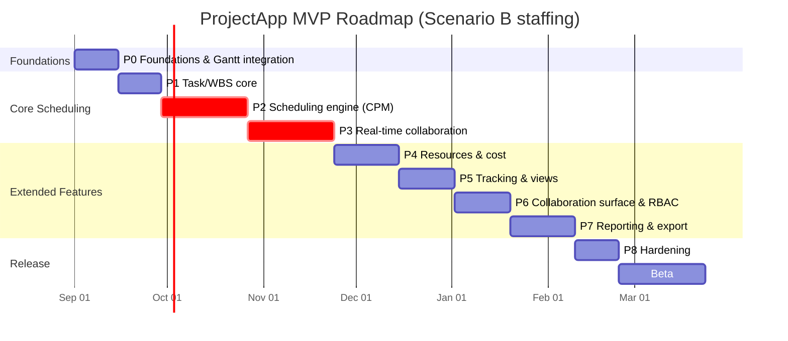

# Implementation Plan: ProjectApp
**Version:** 1.0 | **Companion to:** `docs/FRS.md` | **Date:** 2026-08-14

This document covers architecture, technology choices (with the PRD's open questions
explicitly resolved as ADRs), effort/time budgeting, staffing scenarios, and a phased
roadmap with sequencing changes from the PRD where risk-first ordering argues for them.

---

## 1. Architecture

```
┌──────────────────────────────────────────────────────────────────────┐
│ Client (React + TS SPA)                                              │
│  ┌───────────────┐ ┌───────────────┐ ┌───────────────┐ ┌───────────┐ │
│  │ Gantt (canvas) │ │ Grid (virtual)│ │ Resource/Cal  │ │ Kanban    │ │
│  └───────┬───────┘ └───────┬───────┘ └───────┬───────┘ └─────┬─────┘ │
│          └──────────────── shared client store (Zustand) ────┘       │
│                     │ REST (queries/mutations)   │ WebSocket (live)  │
└─────────────────────┼────────────────────────────┼───────────────────┘
                       ▼                            ▼
┌──────────────────────────────────────────────────────────────────────┐
│ API Gateway (REST, authn/authz, rate limit)                          │
├──────────────────────────────────────────────────────────────────────┤
│ Application services (Node.js/TypeScript, modular monolith)          │
│  Projects/Tasks/Resources CRUD │ RBAC │ Comments/Notifications        │
├──────────────────────────────────────────────────────────────────────┤
│ Scheduler Service (isolated, CPU-bound)                              │
│  - Per-project single-writer mutation queue                          │
│  - In-memory dependency graph cache per active project                │
│  - CPM forward/backward pass, incremental (topo-sort from dirty node) │
│  - Resource leveling                                                  │
├──────────────────────────────────────────────────────────────────────┤
│ Realtime Hub (WebSocket, project-scoped rooms)                       │
│  - Broadcasts scheduler deltas + presence                             │
│  - Yjs doc sync for free-text fields (notes/comments)                 │
├──────────────────────────────────────────────────────────────────────┤
│ Reporting/Export workers (async job queue)                           │
│  - Headless render (PDF/PNG Gantt), XLSX/CSV builders, JSON export    │
└──────────────────────────────────────────────────────────────────────┘
                       │
                       ▼
┌──────────────────────────────────────────────────────────────────────┐
│ PostgreSQL (primary store, relational integrity for the task graph)  │
│  + Redis (WebSocket pub/sub fan-out, job queue, session/presence)    │
│  + Object storage (S3-compatible, exported files)                    │
└──────────────────────────────────────────────────────────────────────┘
```

**Design principle:** start as a modular monolith (Projects/Tasks/RBAC/Comments) with the
Scheduler Service split out as its own process from day one, because it has a different
scaling profile (CPU-bound, needs to hold per-project graphs in memory) and different
deployment cadence risk (it's the piece most likely to need hot-fixing under load). Splitting
everything into microservices upfront would slow the MVP down for no benefit at this scale;
splitting *nothing* would make the scheduler impossible to scale or reason about independently
later.

---

## 2. Architecture Decision Records (resolving the PRD's open questions)

> ADR-001..005 below resolve the PRD's open questions and are recorded inline. **ADR-006 onward
> live as individual files in `docs/adr/`** — they record decisions made during implementation,
> which arrive at a different cadence than the planning ADRs and need their own supersession
> history. Current: `ADR-006` (P0 — Gantt adapter contract lands now, vendor integration gated
> behind licensing; extends ADR-001).

### ADR-001: Buy vs. build the Gantt renderer → **Buy for MVP (license Bryntum or DHTMLX), plan an exit ramp**
- **Context:** PRD explicitly flags this tradeoff (§9). A canvas/WebGL Gantt with
  virtualization, drag-resize, dependency-line drawing, and accessibility support is,
  realistically, a 3-4 month project for a dedicated engineer if built from scratch —
  roughly the same order of magnitude as the entire CPM engine.
- **Decision:** License a commercial Gantt component (Bryntum Gantt is the strongest fit —
  it already models dependencies/constraints/baselines natively, which reduces adapter code)
  for MVP. This converts a multi-month, high-uncertainty build into a ~2-3 week integration.
- **Consequence:** Recurring per-developer license cost and less rendering control; revisit
  build-vs-buy once there's revenue and a concrete reason (cost at scale, a UX limitation the
  vendor won't fix, or a licensing-cost/seat-count crossover). Keep the rendering layer behind
  an internal adapter interface from day one specifically so this swap is possible later
  without touching the scheduling engine or data model.
- **If the user/business prefers open-source only:** fall back to forking `frappe-gantt` or
  `svar-gantt` and hardening it, but budget 6-8 additional weeks versus the buy path, concentrated
  in M1 (see roadmap) — this is the single biggest timeline lever in the whole plan.

### ADR-002: Real-time collaboration → **Hybrid: server-authoritative ordered mutations for schedule data, Yjs (CRDT) only for free text**
- **Context:** PRD asks "Yjs vs custom OT" and leans Yjs. That's right for *text*, but a pure
  CRDT applied to structured scheduling operations (move a task, add a dependency) is the
  wrong tool: CRDTs are built for commutative merges, and two concurrent conflicting date
  changes on the same task don't have a meaningful automatic "merge" — the domain needs a
  decision (last-write-wins, or a lock), not a merge.
- **Decision:**
  - Structural/scheduling mutations (task fields, dependencies, assignments, calendars) go
    through a **single-writer, per-project ordered mutation queue** on the Scheduler Service
    (similar in spirit to Figma's server-authoritative model): client sends an intent, server
    applies it, recomputes CPM, and broadcasts the resulting delta. This keeps CPM output
    deterministic and auditable, which the FRS's audit-log requirement (FR-COL-07) depends on.
  - Free-text collaborative surfaces (task notes, comment bodies) use **Yjs** for
    character-level concurrent editing, exactly as the PRD suggests, because text genuinely
    does merge commutatively and users expect Google-Docs-style behavior there.
  - Presence/cursors ride the same WebSocket connection as a lightweight ephemeral channel
    (not persisted, not CRDT).
- **Consequence:** Two sync mechanisms instead of one is more moving parts, but each is used
  where it's actually the right tool; a Yjs-only design would either be unsound for schedule
  data or would require reimplementing server-authoritative semantics on top of Yjs anyway
  (which is more work than building it directly).

### ADR-003: Backend language → **Node.js/TypeScript across the board for MVP**, not Go
- **Context:** PRD flags Go/Rust as "better at scale" for the CPU-bound CPM engine.
- **Decision:** Ship MVP entirely in TypeScript (shared types with the frontend, one hiring
  pool, faster iteration). The stated perf targets (500ms/5k tasks, 150ms incremental) are
  achievable in Node with an efficient in-memory graph algorithm (topological sort is O(V+E);
  5,000 tasks with realistic dependency density is not a large graph) — this is an algorithm
  and data-structure problem, not fundamentally a language problem, at MVP scale.
- **Consequence:** Revisit Go/Rust only if profiling in production shows the scheduler is
  actually CPU-bound at real project sizes (the 50,000-task enterprise tier is the plausible
  trigger for this, not MVP's 5,000-task target). Isolating the Scheduler Service as its own
  process (§1) makes this a contained rewrite later rather than a whole-system migration.

### ADR-004: `.mpp` import → **Not in MVP; `.xml` interchange import as fast-follow**
- **Context:** PRD flags `.mpp` as high complexity (proprietary binary/OLE-compound-document
  format) and asks whether it's required for adoption.
- **Decision:** Skip native `.mpp` parsing for MVP. Ship CSV/XLSX import (FR-IMP-01) at MVP,
  and MS Project's XML interchange format (a documented, non-binary schema most versions of
  MS Project can export to) as the first post-MVP fast-follow — it gets ~80% of the migration
  value at a fraction of `.mpp`'s parsing complexity, since fields, dependencies, and
  calendars map close to 1:1 onto this data model.
- **Consequence:** Some prospects who only have `.mpp` files and no way to re-export will hit
  friction at signup; mitigate with a short "export your plan to XML from MS Project" help doc
  rather than blocking MVP on binary format reverse-engineering.

### ADR-005: Resource leveling scope → **Priority + float-based heuristic only, no optimizer**
- **Context:** General resource leveling is NP-hard; PRD already scopes MVP to "basic,
  priority-based."
- **Decision:** Implement a deterministic heuristic: sort overallocated assignments by task
  priority (then by late-start, earliest first), delay lower-priority tasks within their
  available float, re-run CPM, repeat until resolved or no float remains. No constraint-solver
  or optimization library. This is honest about being a heuristic in the UI ("basic leveling,"
  not "optimal leveling") so expectations match PRD scope.

---

## 3. Technology Stack Summary

| Layer | Choice | Notes |
|---|---|---|
| Frontend framework | React 18 + TypeScript | Matches PRD |
| Frontend state | Zustand (client) + TanStack Query (server cache) | Lightweight, avoids Redux boilerplate for this surface area |
| Gantt | Bryntum Gantt (licensed) behind an internal rendering adapter | ADR-001 |
| Grid | TanStack Table (virtualized) | Handles sort/filter/virtualization for 2k+ row grids |
| Realtime client | Native WebSocket + Yjs (`y-websocket` provider) for text fields | ADR-002 |
| Backend | Node.js 20 LTS + TypeScript, Fastify (or NestJS if the team prefers stronger DI conventions) | ADR-003 |
| Scheduler service | Standalone TS process, in-memory graph (own npm package shared with tests) | §1, ADR-003 |
| Database | PostgreSQL 15+ | Relational integrity for the dependency graph; JSONB for baseline snapshots |
| Cache/pubsub/queue | Redis (pub/sub for WS fan-out, BullMQ for export jobs) | |
| Object storage | S3-compatible bucket | Exported PDFs/XLSX/JSON |
| Auth | Email/password + OAuth (Google/Microsoft) via a managed auth provider (e.g., Auth0/Clerk) for MVP; SAML/SSO deferred to P2 | Avoids building auth infra pre-revenue |
| Infra | Docker containers, deployed to a managed K8s (or a simpler PaaS like Fly.io/Render for MVP if the team is small) | Cloud-agnostic per PRD NFR |
| Observability | OpenTelemetry traces + a hosted APM (perf targets in the FRS are unverifiable without this from day one) | |
| CI/CD | GitHub Actions, trunk-based with preview environments per PR | |

---

## 4. Effort & Time Budget

Effort is given in **person-weeks** (pw) of focused engineering time, separate from calendar
duration, because calendar duration depends entirely on team size (§5). QA and design/PM
overhead are budgeted separately since the PRD's milestone table only covered raw engineering.

| Epic | Engineering (pw) | QA (pw) | Notes |
|---|---:|---:|---|
| Project setup, auth, org/project shell, CI/CD | 3 | 1 | Foundation; blocks everything else |
| Task CRUD + WBS + rollup | 3 | 1 | |
| Gantt integration (licensed component) + Grid view | 5 | 2 | ADR-001; would be 11-13 pw if built in-house |
| Dependencies + CPM engine (forward/backward pass, incremental recalc, cycle detection) | 6 | 3 | Highest-risk module; QA needs a dedicated correctness test suite (golden-file schedules) |
| Calendars (project/resource/task, exceptions) | 2 | 1 | |
| Resources, assignments, cost calc | 3 | 1 | |
| Overallocation detection + basic leveling | 3 | 1.5 | ADR-005 |
| Kanban + Calendar view | 2 | 1 | |
| Baselines + tracking + variance | 2.5 | 1 | |
| Real-time collaboration (mutation queue, WS hub, presence, Yjs text sync) | 7 | 3 | Second highest-risk module |
| Comments, @mentions, notifications (in-app + email) | 2.5 | 1 | |
| Audit log/activity feed | 1.5 | 0.5 | |
| RBAC (4 roles, server-enforced) | 2.5 | 1.5 | Security-sensitive, needs explicit negative-path testing |
| Reporting (burndown/burnup, cost, utilization) | 3 | 1 | |
| Export (PDF/PNG server-render, XLSX, CSV, JSON) | 3 | 1 | |
| CSV/XLSX import + mapping UI | 2.5 | 1 | |
| Performance hardening (virtualization, incremental recalc tuning, load testing to targets) | 3 | 1.5 | Cross-cutting, scheduled late but not skippable |
| Accessibility pass (WCAG 2.1 AA, incl. accessible fallback table for canvas Gantt) | 2 | 1 | Cross-cutting |
| **MVP subtotal** | **~56.5 pw** | **~22 pw** | ≈ 78.5 person-weeks total |
| Contingency (risk buffer, 25%) | ~14 pw | ~5.5 pw | CPM + realtime are novel enough to warrant this |
| **MVP total (with buffer)** | **~70.5 pw** | **~27.5 pw** | |

Design/PM overhead (not in the table): budget roughly 0.3-0.4 FTE sustained across the whole
MVP window for product/UX (Gantt/Grid interaction design is non-trivial) — call it an
additional **~10-12 person-weeks** of design time spread across the timeline, front-loaded
into the first third.

---

## 5. Staffing Scenarios & Calendar Timeline

Applying the ~70.5 engineering pw + ~27.5 QA pw budget (§4) under different team sizes.
QA work overlaps engineering (starts ~2-3 weeks behind, not sequential), so calendar time is
driven primarily by engineering pw ÷ team size, with QA fitting inside that window rather than
extending it, except at the tail (final hardening/regression pass adds ~2 weeks regardless of
team size).

| Scenario | Team | Engineering calendar time | + QA tail | **Total to MVP GA** |
|---|---|---:|---:|---:|
| A — Lean (matches PRD's own assumption) | 2 full-stack engineers | ~35-40 wks | +2 wks | **~9-10 months** |
| B — Recommended | 4 engineers (2 FE-leaning, 2 BE-leaning, one of whom owns the scheduler) + 1 QA + 0.5 design/PM | ~18-20 wks | +2 wks | **~5-5.5 months** |
| C — Accelerated | 6 engineers + 1 QA + 1 design/PM + 0.5 DevOps | ~13-15 wks | +2 wks | **~4 months** |

**Recommendation: Scenario B.** Scenario A (the PRD's own baseline assumption) is workable
but pushes GA toward the end of the year and concentrates key-person risk on two people
carrying both the CPM engine and real-time collab simultaneously — the two highest-risk
modules in §1 of the FRS. Scenario C's speed gain over B is real but modest (~1-1.5 months)
relative to the coordination overhead of a 6-person team on a codebase this
architecturally coupled (schedule engine ↔ realtime ↔ Gantt rendering all touch the same
core data model). Scenario B gives enough parallelism to run the Gantt/Grid UI, the CPM
engine, and RBAC/collab foundations concurrently in M1-M2 without the two riskiest pieces
sharing an owner.

*(These are engineering-effort estimates, not a commitment — validate against your actual
hires' domain familiarity with scheduling algorithms and CRDTs specifically, since both are
specialist areas that generalist full-stack hires may need ramp-up time on.)*

---

## 6. Phased Roadmap

The PRD's milestone table (M1-M6 + Beta) is directionally right but sequences dependencies
and resources (M1→M2→M3) before validating the highest-risk piece — the CPM engine — against
real-time collaboration, which is architecturally entangled with it (ADR-002). This plan
re-sequences so the two highest-risk subsystems (§1) are proven together early, before the
UI surface area (Kanban, Calendar view, reporting) is built on top of them. Durations below
assume **Scenario B staffing** (§5).

| Phase | Scope | Duration | Rationale for placement |
|---|---|---|---|
| **P0 — Foundations** | Auth, org/project shell, CI/CD, DB schema, Gantt/Grid library integration (ADR-001), empty-state UI | 2 wks | Nothing else can start without this |
| ↳ *P0 status (2026-08-15)* | Landed: workspace/CI/dev stack, `packages/shared-types` contracts, DB schema + migrations, API (auth, project shell, RBAC, audit), web shell + Gantt adapter contract + accessible table. **Outstanding: Gantt vendor integration (ADR-006 — FR-VIEW-01/02 unmet, gated before P1 exit), FR-AUTH-02 OAuth, email delivery.** | — | Vendor licensing is now on the P1 critical path |
| **P1 — Task/WBS core** | Task CRUD, WBS hierarchy + rollup, milestones, calendars | 2 wks | |
| **P2 — Scheduling engine** | Dependencies (FS/SS/FF/SF + lag), CPM forward/backward pass, incremental recalc, cycle detection, constraints, critical path in Gantt | 4 wks | Highest-risk module — proven in isolation before realtime is layered on |
| **P3 — Real-time collaboration** | Mutation queue, WebSocket hub, presence, Yjs text sync, conflict/last-write-wins UX | 4 wks | Second highest-risk module; validated against the now-stable scheduling engine from P2 rather than against a moving target |
| **P4 — Resources & cost** | Resource types, assignments, cost calc, overallocation detection, basic leveling | 3 wks | Depends on stable scheduling engine (P2) |
| **P5 — Tracking & views** | Baselines, variance, Kanban, Calendar view | 2.5 wks | Lower risk, builds on P1-P4 |
| **P6 — Collaboration surface** | Comments, @mentions, notifications, audit log, RBAC hardening | 2.5 wks | RBAC enforcement threaded through everything built so far, tested against it |
| **P7 — Reporting & export** | Burndown/burnup, cost/utilization reports, PDF/PNG/XLSX/CSV/JSON export, CSV/XLSX import | 3 wks | Needs a stable data model across all entities to report on |
| **P8 — Hardening** | Performance tuning to FRS targets, accessibility pass, security review, load testing | 2 wks | Cross-cutting, cannot be meaningfully done earlier |
| **Beta** | Internal dogfood + pilot customers, feedback-driven fixes | 3-4 wks | |

**Total: ~26-27 weeks (~6-6.5 months) engineering + beta, consistent with Scenario B's
5-5.5 month engineering estimate plus the beta tail.**



---

## 7. Phase 2 Outlook (not scheduled in detail — directional only)

Per PRD §4, sequenced roughly by dependency and value:
1. **EVM metrics** (PV/EV/AC/CPI/SPI/EAC/ETC) — mechanically straightforward once baselines +
   actuals (MVP) exist; mostly a reporting-layer addition (~3-4 pw).
2. **`.xml` import** (ADR-004 fast-follow) — ~2-3 pw, high leverage for adoption.
3. **REST API + webhooks** — exposes the same internal APIs the SPA already uses; the
   incremental cost is mainly API-key auth, rate limiting, and docs (~4-5 pw).
4. **Custom fields/formula fields, recurring tasks, master/subproject linking** — each is a
   moderate, mostly-independent addition (~2-4 pw each).
5. **Portfolio/cross-project rollup** — architecturally bigger than it looks, since it likely
   needs a cross-project resource pool and permissions model the MVP explicitly excludes
   (PRD non-goal §1); treat as its own mini-planning cycle, not a slot-in feature.
6. **SSO/SAML, SOC 2 scope** — largely compliance/process work, not pure engineering; start
   the SOC 2 readiness process in parallel with MVP if enterprise sales is a near-term goal,
   since audit lead time is long regardless of when the engineering work happens.
7. **Mobile app, Power BI/OData connector, what-if branching** — genuinely separate projects;
   don't estimate them until MVP usage data indicates which is actually the highest-value
   next investment.

---

## 8. Risk Register

| Risk | Likelihood | Impact | Mitigation |
|---|---|---|---|
| CPM engine has a correctness bug that ships (wrong critical path) | Medium | High — undermines the core value prop | Golden-file test suite with hand-verified schedules of increasing complexity (including known tricky cases: SF dependencies, negative lag, mixed manual/auto subtrees); property-based tests (e.g., "no task's ES ever precedes its predecessor's EF + lag" as an invariant checked on random graphs) |
| Real-time collab conflict handling feels broken to users even though it's "correct" (last-write-wins silently surprises someone) | Medium | Medium | Explicit UI feedback on superseded edits (FR-COL-02); usability-test this specifically in beta, not just functionally test it |
| Licensed Gantt component (ADR-001) has a licensing-cost or extensibility ceiling discovered late | Low-Medium | Medium | Time-box a spike against both Bryntum and DHTMLX in P0 before committing; keep the adapter interface (§ADR-001) real, not aspirational |
| Performance targets (500ms/5k tasks) don't hold once real calendars/constraints are layered on top of the naive algorithm | Medium | Medium | Budget the dedicated P8 hardening phase; add perf regression tests to CI (not just manual spot-checks) as soon as P2 lands |
| Canvas-based Gantt undermines the WCAG 2.1 AA NFR | Medium | Medium | Build the accessible fallback table view (FR-VIEW representation) alongside the Gantt from P0, not bolted on in P8 — retrofitting accessibility onto a canvas UI is materially harder than designing it in |
| Scope creep from Phase 2 features bleeding into MVP (EVM, custom fields, API) | Medium | Medium | This document's MVP/P2 tagging (FRS §3) is the enforcement mechanism — treat any P2-tagged item requested mid-MVP as a scope change requiring explicit re-planning, not silent absorption |
| Two-person team (Scenario A) creates key-person risk on CPM + realtime | Medium (if Scenario A chosen) | High | Recommend Scenario B (§5); if Scenario A is forced by budget, at minimum pair-program the CPM engine so knowledge isn't siloed in one person |

---

## 9. Summary Recommendation

- **Feasibility:** High. Nothing in the PRD is research-grade uncertain; the CPM algorithm
  and CRDT-based collaboration are both well-understood problems with known patterns — the
  risk is in careful engineering and correct sequencing, not invention.
- **Biggest single lever on timeline:** buy vs. build the Gantt renderer (ADR-001). Buying
  saves an estimated 6-10 weeks and is the clear recommendation for MVP.
- **Biggest architectural risk to get right early:** treating real-time collaboration and CPM
  recalculation as one coupled problem (ADR-002) rather than "add Yjs everywhere" — the
  roadmap in §6 deliberately proves these together in P2-P3 before building UI surface area
  on top.
- **Recommended path:** Scenario B staffing (§5), ~5-6.5 months to MVP GA including beta,
  following the re-sequenced roadmap in §6, with the ADRs in §2 adopted as the answers to the
  PRD's open questions (§9 of the PRD).
